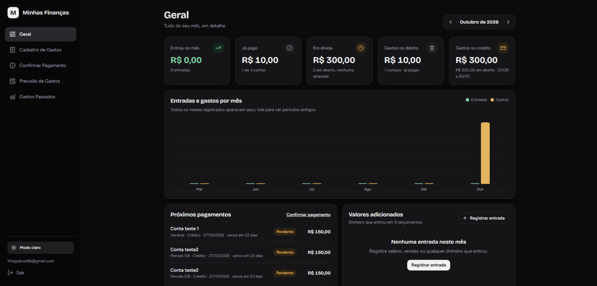
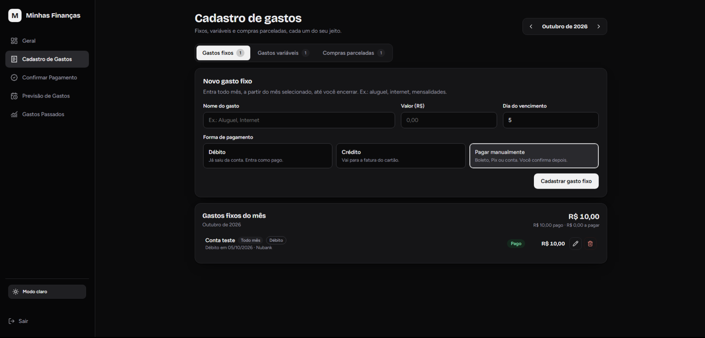
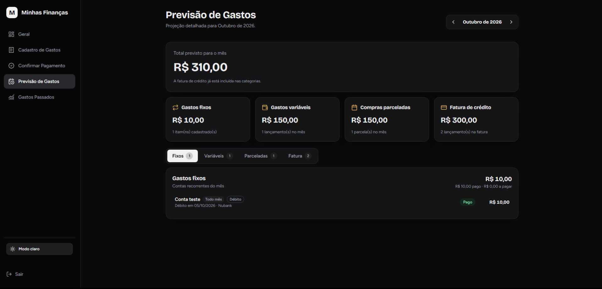
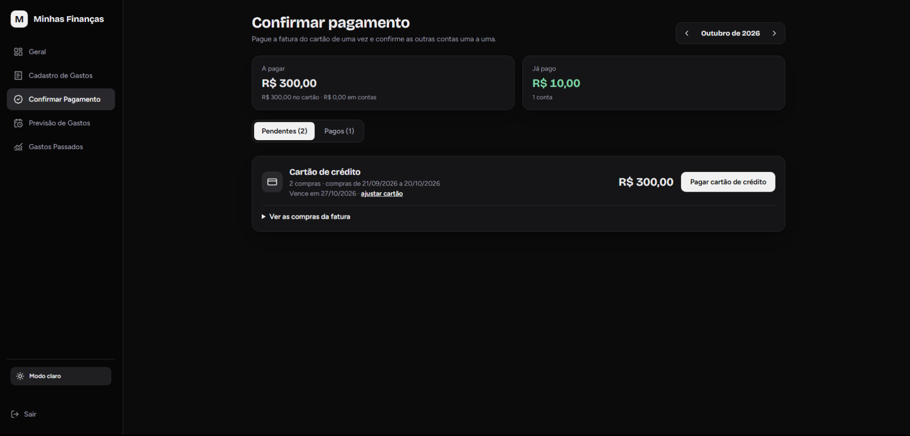
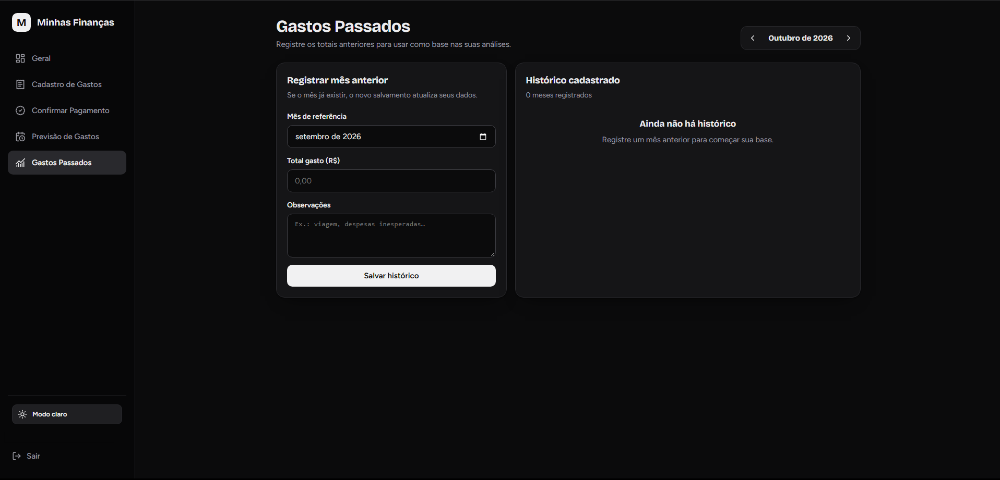

# 💳 Minhas Finanças — Dashboard Financeiro Pessoal

Um sistema web completo e moderno de gestão financeira pessoal, projetado para o controle detalhado de despesas fixas, variáveis, compras parceladas e gerenciamento de faturas de cartão de crédito, com suporte a múltiplos usuários e projeções mensais.

---

## 📸 Demonstração da Aplicação

### 📊 Visão Geral (Dashboard)
Painel principal consolidado com resumos do mês, gráficos dinâmicos e próximos pagamentos.

  

### 📝 Cadastro de Gastos
Gerenciamento flexível de despesas divididas entre fixas, variáveis e compras parceladas, com suporte a formas de pagamento por débito, crédito ou manual[cite: 11].

  

### 🔮 Previsão de Gastos
Projeção detalhada e categorizada das despesas previstas para o mês vigente[cite: 10].

  

### ✅ Confirmação de Pagamento
Módulo dedicado para controle e quitação de contas pendentes e fechamento de faturas de cartão de crédito[cite: 7].

  

### 📈 Gastos Passados
Registro e histórico consolidado de meses anteriores para embasamento de análises financeiras[cite: 8].

  

---

## 🚀 Tecnologias Utilizadas

Este projeto foi desenvolvido utilizando tecnologias modernas do ecossistema web:

* **Front-end:** React, Vite, JavaScript / TypeScript, Tailwind CSS
* **Back-end & Banco de Dados:** Supabase (PostgreSQL)
* **Segurança & Autenticação:** Supabase Auth & Row Level Security (RLS)
* **Hospedagem & Deploy:** Vercel

---

## ⚙️ Principais Funcionalidades

* **Controle de Gastos Flexível:** Cadastro de despesas fixas (recorrentes), variáveis e compras parceladas[cite: 11].
* **Gestão de Cartão de Crédito:** Definição personalizada de dias de fechamento e vencimento de fatura, com alocação automática de compras.
* **Múltiplas Formas de Pagamento:** Suporte a pagamentos via débito automático (com indicação de banco), crédito ou manual[cite: 2].
* **Segurança Baseada em Linha (RLS):** Isolamento completo de dados por usuário utilizando políticas de segurança nativas do PostgreSQL[cite: 4, 6].
* **Histórico e Projeções:** Acompanhamento de meses passados[cite: 3] e painel de projeções futuras[cite: 10].

---
